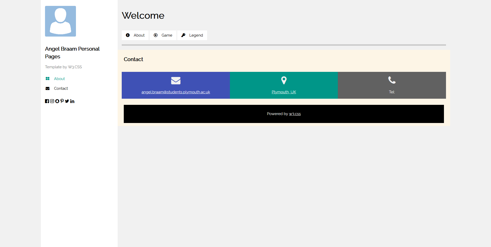
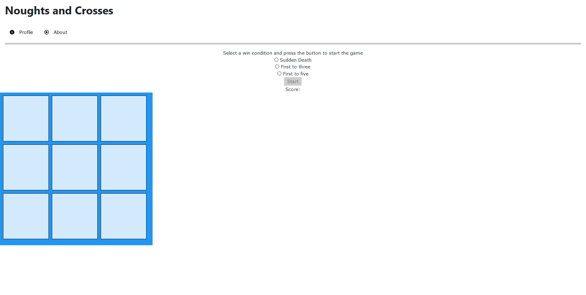
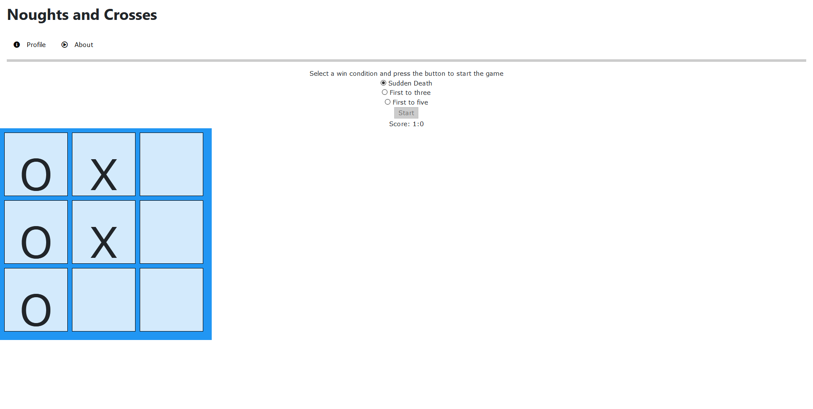

# SOFT-166-Project

### Accreditations
I used a profile template and style sheets from W3 Schools in combination with the bootstrap style sheet to create the design of 
the website. Additionally jQuery was used to control the Philips Hue lights that announced the winner of the game. Additionally I used a placeholder image from Pixabay for the profile page profile image (https://pixabay.com/vectors/avatar-icon-placeholder-1577909/)

jQuery: https://jquery.com/

Bootstrap: https://getbootstrap.com/

W3Schools: https://www.w3schools.com/w3css/w3css_templates.asp

### Application
The Noughts and Crosses game has a number of available win conditions though you do need to select the radio button of the one you want twice in order for it to be guaranteed to go through.   Player One (Nought) and Player Two
(Cross) will then alternate placing their pieces upon the board. When player one wins the lights will turn green and when player two wins the lights will turn red,  in addition to this a alert box will appear on the screen to declare
the winner. 

### Video
https://youtu.be/3bLeCPew2v4

### Screenshots

